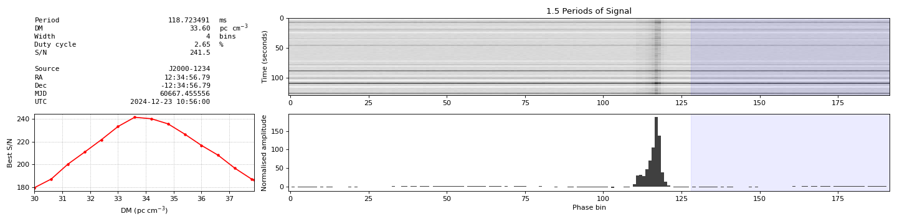
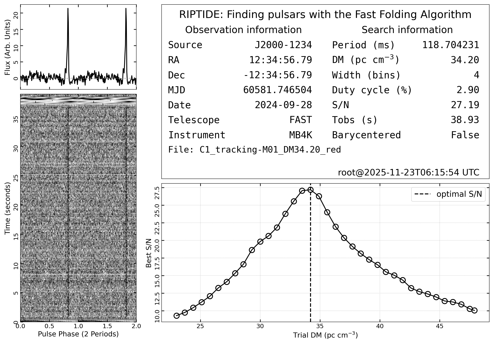
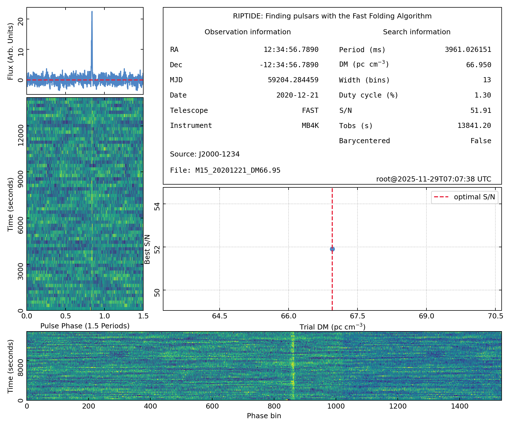

###### candidate folding plot from riptide:

###### updated folding plot (black and color) 

  
  

###### updated folding plot (for long period pulsar with narrow duty) 

  
  

###### long period pulsar with narrow duty, examples 

  
  

